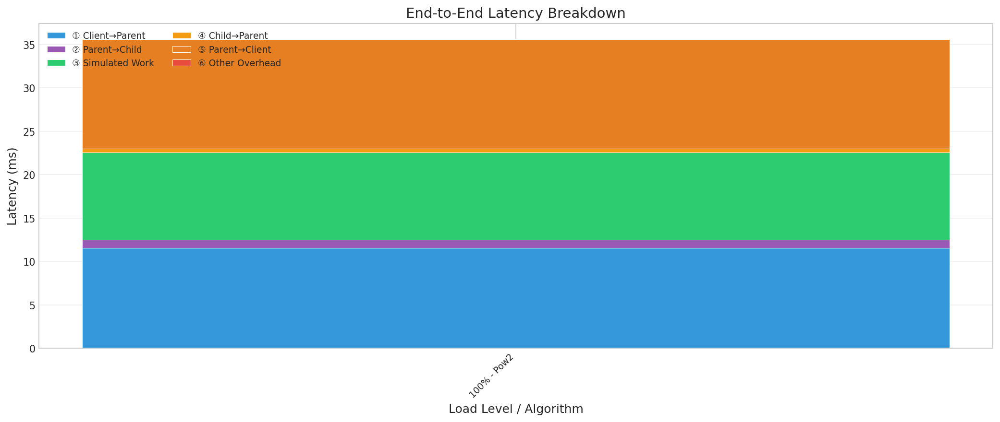

# Routing Algorithm Improvements

This document captures performance issues discovered during the routing algorithm study and proposes improvements for Ray Serve's request routing.

## Executive Summary

The current routing implementation has significant overhead that impacts request latency:

1. **Queue length probing is in the request path** - Requests with cache misses on both chosen candidate replicas wait for queue length probes before being routed
2. **Thundering herd on probes** - Multiple handles probe the same replicas simultaneously
3. **Unnecessary probing for simple routers** - Random and RoundRobin don't need queue lengths but still probe

## Problem 1: Queue Length Probing in Request Path

### Current Behavior

```
Request → choose_replicas() → _select_from_candidate_replicas() → probe if needed → route
```

**Cache is enabled by default** (`use_replica_queue_len_cache=True` outside Ray Client).

**Probing is triggered when:**
1. Cache miss or entry expired (TTL: 10s via `RAY_SERVE_QUEUE_LENGTH_CACHE_TIMEOUT_S`)
2. Cached `queue_len >= max_ongoing_requests` (forces re-probe to check if capacity freed)

**The problem:** Probing blocks the request path with a 1s timeout per replica. Under load, when many replicas are at capacity, constant re-probing causes latency spikes.

### Impact

- **Added latency**: request pays the probe latency cost
- **Timeout accumulation**: Under load, probes queue up and timeout
- **Observed in study**: `client_to_parent_delay_ms` p50 of 24ms when probing is slow

The latency breakdown shows routing overhead (Client→Parent, Parent→Child delays) often exceeds the actual simulated work time, especially under high load:



## Problem 2: Thundering Herd on Probes

### Current Behavior

Each `DeploymentHandle` has its own router that independently probes replicas. While pow2 only probes 2 replicas per request, high concurrency creates many simultaneous probes:

```
Load Generator Task 1 ─── Handle ─── Router ───┐
Load Generator Task 2 ─── Handle ─── Router ───┼──→ Each probes 2 replicas per request
Load Generator Task 3 ─── Handle ─── Router ───┤    (but many concurrent requests)
...                                            │
Load Generator Task 27 ── Handle ─── Router ───┘
```

With 27 tasks, high concurrency per task, and cache misses:
- Each request probes 2 replicas (pow2 algorithm)
- But with ~500 concurrent requests across all tasks, probes overlap
- Cache entries expire (default timeout), triggering fresh probes
- Under load, this still creates a probe storm as caches churn

Additionally, each probe on cache miss spawns an async task in the router's event loop:
- These probe tasks compete with request handling for event loop time
- Slows down the forward path (client → parent → child)
- Slows down the backward path (child → parent → client)
- Creates a feedback loop: slower responses → more concurrent requests → more probes

### Observed Impact

```
WARNING: Failed to get queue length from Replica(...) within 1.0s
[repeated 11815x across cluster]
```

### Proposed Solution: Centralized Queue Length Service with Background Probing

A two-tier architecture that addresses both problems:

1. **Central Service (Ray Actor)**: One per deployment, maintains queue lengths with timestamps
2. **Router-Level Cache**: Each router maintains its own cache, pulls deltas from central service

```
                         ┌─────────────────────────────────────┐
                         │   Queue Length Service (Ray Actor)  │
                         │   (One per deployment)              │
                         │                                     │
                         │   State: {replica_id: (queue_len,   │
                         │                        timestamp)}  │
                         │                                     │
                         │   - Lazy probing (only if stale)    │
                         │   - Returns only changed replicas   │
                         └─────────────────────────────────────┘
                              ↓ │              ↑         ↑         ↑
               Probe (if stale) │       Pull (when router needs probe)
                                │              │         │         │
┌─────────────┐ ←───────────────┘              │         │         │
│   Replica   │                                │         │         │
│   Replica   │                           ┌────┴───┐ ┌───┴────┐ ┌──┴─────┐
│   Replica   │                           │ Router │ │ Router │ │ Router │
└─────────────┘                           │ Cache  │ │ Cache  │ │ Cache  │
                                          └────────┘ └────────┘ └────────┘
                                               │          │          │
                                          (Process 1) (Process 2) (Process 3)
```

### Key Design Points

1. **Async background pulls** - Router pulls from service in background (not in request path):
   - Request path reads from local cache immediately
   - Background task pulls from service when cache needs refresh
2. **Pull triggered on need** - Router uses existing logic to decide when to pull:
   - Cache miss (no entry for replica), OR
   - Cache entry expired (TTL), OR
   - Replica at `max_ongoing_requests` (full queue)
3. **Lazy probing by service** - Service only probes replica if its own data is stale:
   - No record exists, OR
   - No update for 10s, OR
   - Replica at `max_ongoing_requests`
4. **Delta updates** - Router sends timestamps, service returns only changed replicas

### Pull Protocol

```
┌──────────────────────────────────────────────────────────────────────────┐
│                              Router                                      │
│                                                                          │
│  REQUEST PATH (sync):                    BACKGROUND TASK (always running):│
│  ┌─────────────────────────┐            ┌─────────────────────────────┐ │
│  │ 1. Check cache          │            │ while True:                 │ │
│  │ 2. If hit → route       │            │   await work_queue.get()    │ │
│  │ 3. If miss → use stale  │ ─enqueue─> │   # wakes up when work added│ │
│  │    or random, then      │            │   pull(replicas_to_refresh) │ │
│  │    enqueue refresh work │            │   update_cache(response)    │ │
│  └─────────────────────────┘            └─────────┼───────────────────┘ │
└──────────────────────────────────────────────────┼──────────────────────┘
                                                   │
                                                   ▼
                                    ┌─────────────────────────────┐
                                    │   Queue Length Service      │
                                    │                             │
                                    │ For each replica requested: │
                                    │ - If service data stale:    │
                                    │   probe replica first       │
                                    │ - Return (queue_len, ts)    │
                                    │   if newer than client's    │
                                    └─────────────────────────────┘
```

### Lazy Probing Logic

```python
class QueueLengthService:
    def __init__(self, replica_info: Dict[ReplicaID, ReplicaInfo]):
        self.state: Dict[ReplicaID, (int, float)] = {}  # {replica: (queue_len, timestamp)}
        self.replica_info = replica_info  # {replica: max_ongoing_requests, ...}
        self.staleness_threshold_s = 10.0  # 10 seconds
    
    def _should_probe(self, replica_id: ReplicaID) -> bool:
        entry = self.state.get(replica_id)
        
        # No record exists
        if entry is None:
            return True
        
        queue_len, timestamp = entry
        
        # No update for 10s
        if (time.time() - timestamp) > self.staleness_threshold_s:
            return True
        
        # Replica is at max_ongoing_requests (full queue)
        max_ongoing = self.replica_info[replica_id].max_ongoing_requests
        if queue_len >= max_ongoing:
            return True
        
        return False
    
    async def pull(self, client_timestamps: Dict[ReplicaID, float]) -> Dict[ReplicaID, Tuple[int, float]]:
        updates = {}
        for replica_id, client_ts in client_timestamps.items():
            # Probe if needed
            if self._should_probe(replica_id):
                queue_len = await self._probe_replica(replica_id)
                service_ts = time.time()
                self.state[replica_id] = (queue_len, service_ts)
            else:
                queue_len, service_ts = self.state[replica_id]
            
            # Only return if service has newer data
            if service_ts > client_ts:
                updates[replica_id] = (queue_len, service_ts)
        
        return updates
```

### Existing Router Optimizations (to preserve)

Each router has an important optimization for keeping the cache accurate without constant probing:

**Optimistic Queue Length Tracking**

```
┌─────────────────────────────────────────────────────────────────────────┐
│  1. Router chooses replica based on cached queue length                 │
│                                                                         │
│  2. on_send_request(replica_id)     → Cache[replica] += 1              │
│     Called immediately when sending request                             │
│                                                                         │
│  3. on_new_queue_len_info(replica_id, info) → Cache[replica] = actual  │
│     Called when replica responds with real queue length                 │
└─────────────────────────────────────────────────────────────────────────┘
```

This prevents the "stale cache thundering herd" problem:
- Without increment: If 10 requests all happen to select replica A before any probe returns, they all see queue_len=0 and may all route to A
- With increment: After routing to A, cache[A] becomes 1. Next request selecting A sees queue_len=1, making other replicas more attractive

**With centralized service, routers will:**
- Continue incrementing shared cache on `on_send_request()`
- Receive accurate updates from central service instead of per-router probes
- Maintain locality routing, pow2 selection, and other existing optimizations

**Variables:**
- R = number of replicas
- H = number of routers/handles (each has its own cache)
- RPS = total requests per second across all routers
- Cache hit rate = % of requests where router cache is fresh


### Benefits

- **Zero probe latency in request path** - Routers read from local cache instantly
- **O(R) probes instead of O(H × R)** - where R=replicas, H=handles
- **No event loop contention** - No probe tasks competing with request handling
- **Consistent view** - All routers see the same queue length data
- **Graceful degradation** - If cache is stale, fallback to random selection

---

## Alternative: Push-Based Design (JBT-d)

Instead of the service probing replicas, replicas can **push** their queue length to the central service. This is known as "Join Below Threshold D" (JBT-d) in the literature.

### How It Works

```
┌─────────────┐   push(queue_len, ts)    ┌─────────────────────────────┐
│   Replica   │ ───────────────────────> │   Queue Length Service      │
│   Replica   │   when has capacity      │                             │
│   Replica   │   (ongoing < max)        │   State: {replica: (q, ts)} │
└─────────────┘                          └─────────────────────────────┘
                                                       ↑
                                                  pull (same as before)
                                                       │
                                                 ┌─────┴─────┐
                                                 │  Routers  │
                                                 └───────────┘
```

### Key Benefits

1. **No probing overhead** - Service never probes; replicas push. Eliminates probe RPCs entirely.
2. **Natural backpressure** - Full replicas (`ongoing >= max`) stop pushing. Silence = at capacity.
3. **Fresher data for available replicas** - Replicas with capacity actively announce it.
4. **Simpler service** - Just stores pushes, no probe scheduling or timeout handling.

### Replica Push Logic

```python
class ReplicaActor:
    async def _push_loop(self):
        """Push queue length when replica has capacity."""
        last_pushed_queue_len = None
        
        while True:
            current = self._num_ongoing_requests
            max_ongoing = self._max_ongoing_requests
            
            # Push when:
            # 1. Have capacity (current < max), AND
            # 2. Queue length changed since last push
            if current < max_ongoing and current != last_pushed_queue_len:
                await self._queue_length_service.receive_push(
                    self.replica_id, 
                    current, 
                    time.time()
                )
                last_pushed_queue_len = current
            
            await asyncio.sleep(0.01)  # 10ms check interval
```

### Router Side Unchanged

The router-side design remains the same:
- Local cache with timestamps
- Optimistic increment on `on_send_request()`
- Background pull from service when cache needs refresh
- Existing pow2 selection, locality routing, etc.

---

## Considered: Token-Based Tracking

Another approach is **token-based tracking** where the dispatcher maintains tokens representing each replica's capacity. Routers acquire a token before routing and release it when the request completes.

**Why not chosen:**
- **Adds latency to request path** - Token acquisition requires RPC to dispatcher before routing
- **Token leak on failure** - If router crashes, tokens are stuck until timeout/lease expires
- **Centralized bottleneck** - All routers compete for dispatcher on every request
- **Batching doesn't help** - Can't know how many tokens to fetch (pow2 picks random replicas each time). Fetching too many hoards tokens from other routers; too few requires frequent refills
- **Optimistic increment already provides similar benefit** - `on_send_request()` gives us approximate token semantics locally without RPC

Token-based is more **accurate** (exact tracking) but the queue-length caching approach is **faster** (local cache reads) and sufficient for load balancing purposes where approximate data is acceptable.

---
